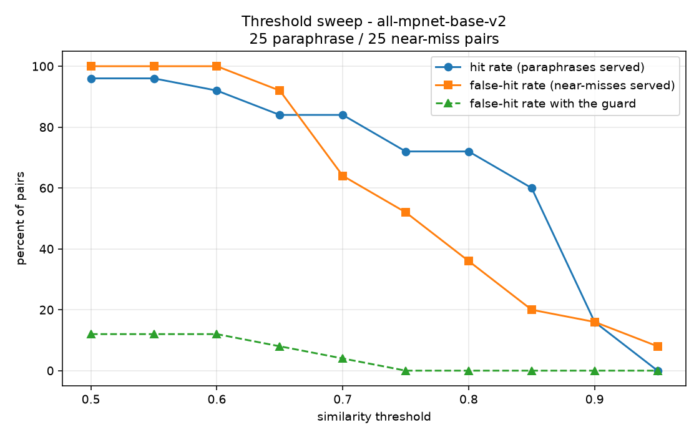

# vector-cache-gateway

[](https://github.com/grunundweiss/vector-cache-gateway/actions/workflows/ci.yml)

A similarity-gated cache in front of a local vector store, built to find out
whether that idea actually works. The short answer is: only under conditions
this README tries to state precisely.

Queries are embedded with `all-mpnet-base-v2`, compared against previously seen
queries by cosine similarity, and served from cache when the nearest one clears
a threshold. The threshold is chosen from a measured sweep, the cost saving is
measured rather than asserted, and the cases where similarity is not enough are
handled by something other than similarity, including where
they come out badly.

**Contents.** [What a hit saves](#what-a-cache-hit-actually-saves) ·
[Threshold](#choosing-the-threshold) · [The guard](#the-guard-what-a-threshold-cannot-do) ·
[Conversations](#conversations-a-follow-up-is-not-a-question) ·
[Tenancy](#tenancy-the-same-question-two-users) ·
[Freshness](#freshness-two-clocks) · [Scale](#scale-when-the-scan-stops-being-cheap) ·
[As middleware](#using-it-as-middleware) · [Observability](#observability) ·
[Limitations](#known-limitations)

---

## What a cache hit actually saves

| Configuration | Hit p50 | Miss p50 | Speedup |
|---|---|---|---|
| Retrieval-only (default) | 39.8 ms | 39.4 ms | **0.99×** |
| With a 500 ms generation call | 40.3 ms | 540.4 ms | **13.4×** |

With the default retrieval-only backend, a cache hit is not measurably faster
than a miss but nslower. Both paths must embed the query before
they can do anything, and that ~39 ms embedding pass dominates the microseconds
of vector search that a hit avoids.

The cache is only worth having when the work it skips is expensive. Install a
generator and a hit skips generation entirely:

```python
from gateway import InferenceEngineGenerator, LocalVectorStore, SemanticCacheGateway

gateway = SemanticCacheGateway(
    vector_store=store,
    generator=InferenceEngineGenerator(engine),  # anything with generate_inference()
)
```

`gateway/generator.py` defines the protocol. The default `RetrievalOnlyGenerator`
returns the retrieved passage verbatim and needs no model server, which is what
makes the repo runnable standalone.

Full numbers and hardware: [`results/benchmarks.md`](results/benchmarks.md).

---

## Choosing the threshold

The threshold is the first gate, and on its own it is not enough. It is picked
from measurement, not by hand.

[`benchmarks/threshold_sweep.py`](benchmarks/threshold_sweep.py) scores 25
hand-labeled paraphrase pairs (same question, different words that should hit) against 25 near-miss pairs (different question, similar surface that
must not hit), using the real encoder.

| Threshold | Hit rate | False-hit rate | Margin | False hits **with the guard** |
|---|---|---|---|---|
| 0.65 | 84% | 92% | -8% | 8% |
| 0.70 | 84% | 64% | 20% | 4% |
| **0.75** | **72%** | 52% | 20% | **0%** |
| 0.80 | 72% | 36% | 36% | 0% |
| **0.85** | **60%** | **20%** | **40%** | **0%** |
| 0.90 | 16% | 16% | 0% | 0% |



**This repo defaults to 0.85**, the widest margin measured without the guard.
An earlier version defaulted to 0.75 and called it a "strict safety threshold";
unguarded it serves **52% of near-misses** and returning the wrong regulatory
answer more often than a coin flip, confidently, with no signal to the caller.

### The default is now arguably too strict

The last column is new, and it undercuts the choice of 0.85. With the guard on by default led to **the false-hit rate is 0% from 0.75 upward**, so 0.85
buys no measured safety over 0.75 and costs 12 points of hit rate (60% vs 72%).
On this labeled set, 0.75 dominates.

The reason the two work so well together is that they fail in different places.
The guard's three blind spots (listed below) score **0.6419, 0.6584 and 0.7103**
(all *below* 0.75). The pairs the threshold cannot stop are the high-scoring
ones, and those are exactly what the guard catches. Each covers the other's
failure mode, and 0.75 is the lowest threshold that sits above every known
blind spot.

**The default has not been changed**, for one reason: those three blind spots
are the ones *in this set*. The lexicons were written against these 50 pairs, so
the claim "every guard blind spot scores below 0.75" is in-sample and could be
one unseen near-miss away from false. 0.85 keeps a margin against blind spots
nobody has found yet, and pays 12 points of hit rate for it.

Drop to 0.75 once you have run the sweep on labeled pairs from your own domain
and the guarded false-hit column is still 0%. This becomes the evidence this
argument turns on, and `benchmarks/threshold_sweep.py` now prints it.

### The uncomfortable part

Even 0.85 leaves a 20% false-hit rate, and the two distributions **fully
overlap**: all 25 near-misses score above the weakest genuine paraphrase
(0.3571). No threshold separates them cleanly. The worst collisions:

| Similarity | Pair |
|---|---|
| 0.9792 | transfers over **500,000** NOK vs. over **50,000** NOK |
| 0.9520 | **maximum** retention period vs. **minimum** retention period |
| 0.9343 | MFA for **internal** transfers vs. **external** transfers |

A 10× difference in a reporting threshold, and a pair of exact opposites, scored
as near-identical and all three clear the shipped 0.85. Sentence embeddings
encode topic; they do not reliably encode the numeric and polarity distinctions
that decide a compliance answer.

**Cosine similarity alone is not a sufficient gate for this domain.** That is
what the next section is for.

---

## The guard: what a threshold cannot do

A guard runs *after* the threshold and *before* the answer is served. It sees
both strings, which are the incoming query and the highest scored cached key that 
gets to veto. Three checks, all lexical, all deterministic
([`gateway/guard.py`](gateway/guard.py)):

| Check | Vetoes when | Catches |
|---|---|---|
| numeric | the numeric literals differ | 500,000 vs 50,000 NOK |
| polarity | the two texts pick different members of a mutually exclusive group, or differ in negation | maximum vs minimum, internal vs external, KYC vs AML, may vs may not |
| acronym | neither text's acronyms are a subset of the other's | any acronym swap the polarity lexicon does not already name |

(The polarity lexicon happens to list `kyc` and `aml` as members of one group,
so it vetoes that pair before the acronym check ever runs. The acronym guard is
the general case for the acronyms nobody thought to enumerate.)

Measured against the same 50 labeled pairs, offline, no model needed
(`python -m benchmarks.guard_eval`):

| | Result |
|---|---|
| Near-miss pairs vetoed | **22 / 25** |
| Genuine paraphrases vetoed | **0 / 25** |
| Highest-scoring near-misses from the sweep vetoed | **5 / 5** |
| False-hit rate at 0.85, guarded vs unguarded | **0% vs 20%** |
| Cost per check | **8–15 µs** p50 (two machines) |

End to end, on the mixed stream in `results/benchmarks.md`: the hit rate goes
from 42% to **37%** when the guard is switched on. The guard costs 5 hits per
100 queries, and the sweep says the false-hit rate over the same pairs goes 20%
→ 0%, so the arithmetic is consistent with those 5 having been wrong answers.
The stream also allows hits across unrelated pairs, so read that as consistency,
not proof.

All five near-miss pairs that the encoder scored above the shipped threshold and
the ones the gate demonstrably cannot stop are vetoed, and no genuine
paraphrase is. **These numbers are in-sample**: the lexicons were written
against these pairs. They show the guard does what it claims on the cases the
sweep proved were dangerous; they do not show it generalizes. Deployed
elsewhere, `gateway/guard.py` is the file to edit.

The three it misses are instructive about the limit of a word-list and their
similarity scores are what the threshold argument above turns on:

```
0.7103  How long is a suspicious activity report retained?
    vs  How long is an internal audit report retained?
0.6584  When must a customer file be re-reviewed?
    vs  When must a customer file be archived?
0.6419  Is a written record of the risk assessment required?
    vs  Is a written record of the board decision required?
```

Every one is a swap between two things a lexicon would have to have been told
about in advance. Every one also scores below 0.72, which is why the threshold
catches what the guard does not.

A veto costs a cache miss both money and latency. A false hit costs a confidently
wrong answer. That asymmetry is the entire argument for running the guard, and
for tuning it toward vetoing too much rather than too little.

The guard is on by default. `guard=None` restores the pre-guard behaviour the
sweep measured at a 20% false-hit rate.

**Second opinion on borderline hits.** `RerankGuard` wraps any
`scorer(query, key) -> float` that acts as a cross-encoder reads both strings together and
notices what two independent embeddings flattened. It runs only between the
threshold and a confidence band, because a 0.99 match does not need a second
opinion and paying for one on every hit erodes the saving:

```python
from sentence_transformers import CrossEncoder
model = CrossEncoder("cross-encoder/ms-marco-MiniLM-L-6-v2")
guard = CompositeGuard([*default_guard().guards,
                        RerankGuard(lambda q, k: float(model.predict([(q, k)])[0]))])
```

**Per-intent thresholds.** Not every question is equally dangerous to get wrong,
and the pairs that score highest are the ones that hinge on a number.
`threshold_policy="intent"` raises the bar on those
([`gateway/policy.py`](gateway/policy.py)). The shipped values are *policy, not
measurement*, and `benchmarks/intent_sweep.py` was written to replace them with
evidence.

It has now been run, and **it disagrees with the shipped policy in the opposite
direction** ([`results/intent_thresholds.json`](results/intent_thresholds.json)):

| Intent | Shipped policy | Measured | Pairs in cluster |
|---|---|---|---|
| numeric | 0.95 | 0.85 | 1 paraphrase, 0 near-miss |
| polarity | 0.93 | 0.85 | 8 |
| entity | 0.90 | 0.70 | 8 |
| general | 0.85 | 0.80 | 11 |

Every measured value is *looser*, and the reason is the guard: the sweep applies
it to the near-miss set first, which removes almost everything a raised
threshold was supposed to protect against. With the dangerous pairs already
vetoed, the data says lower the bar and take the hit rate.

The shipped defaults are unchanged because the cluster sizes make
the measurement unusable. The numeric cluster contains exactly one paraphrase pair and zero near-misses after the
guard; the sweep correctly refused to derive a threshold from it and kept the
global. Deriving 0.70 for "entity" from 8 pairs is a guess with a decimal point
on it. Run it on a few hundred labeled pairs from your own domain and the
numbers might mean something.

**Negative feedback.** A false hit is invisible to the system and obvious to the
user. `gateway.feedback(entry_id, helpful=False)` evicts the entry that was
actually served by id, not by re-running the search, which could delete
something else. `rephrase_feedback=True` additionally treats an immediate
rephrase as a thumbs-down; it is off by default because with a conversational
resolver a legitimate follow-up looks exactly like a rephrase.

---

## Conversations: a follow-up is not a question

```
user: What's included in the Basic plan?
user: What about the pro plan?
```

Embedded literally, the second message is four words with no subject. It lands
near every other "what about X" ever asked, in every conversation, about every
topic, and the cache serves one of them. The similarity is not wrong; the
string being compared is not the question.

```python
from gateway import SemanticCacheGateway, Turn

gateway = SemanticCacheGateway(vector_store=store, resolver="context")
gateway.process("And the limit?", history=[Turn("user", "What about KYC records?")])
```

`ContextWindowResolver` prepends recent user turns **only when the turn looks
like it needs them** as an anaphor with no antecedent, a continuation opener, or
a fragment too short to stand alone. Prepending unconditionally is its own
failure mode: every question in a session then shares a prefix, their embeddings
converge, and the cache starts answering one with another.

`RewriteResolver` hands the history to anything that rewrites the turn into a
standalone question. It is the better answer and it has a bill attached if the
rewriter costs as much as the generation being skipped, the cache has moved the
model call rather than removed it.

The resolved text becomes both the embedded text *and* the cache key, so the
guard compares resolved strings too.

---

## Tenancy: the same question, two users

An exact-match cache can only return A's answer to B if B sends A's exact
question. A similarity cache returns it when the questions are close
and "What is my account balance?" is close to itself no matter who asks. The
answer contains A's balance.

```python
gateway.process(question, namespace=user_id)
```

Partitions are enforced by construction, not by a filter: each namespace gets
its own cache, its own vectors, its own index
([`gateway/partition.py`](gateway/partition.py)). No code path compares a vector
in one namespace against a vector in another, because they are never in the same
matrix. A post-search filter would be one forgotten predicate away from the leak
above, and with ANN it is worse as the returning neighbours already chosen, so a
filtered-out result is a hit you silently lost.

The cost is duplication: the same question from a thousand tenants is cached a
thousand times. That is right for answers derived from per-tenant data and wrong
for a shared public corpus, which should use one namespace and say so out loud.
Worst-case vector memory is `max_namespaces × max_entries × dim × 4` bytes at the defaults is
3.75 GB, a number worth reading before accepting them.

---

## Freshness: two clocks

**The corpus changed.** `LocalVectorStore` carries a version counter that
`ingest_document` bumps; the gateway drops the whole cache when it changes.
Blunt on purpose to decide which entries a new document affects costs more than
repopulating on demand.

**The answer aged.** "What are the store hours" and "what is the current
promotion" go stale with no document changing at all. Per-entry TTLs handle
what corpus invalidation cannot:

```python
SemanticCacheGateway(vector_store=store, ttl=24 * 3600)   # cache-wide default
gateway.process("today's rate?", ttl=60)                   # this answer only
```

Expired entries are dropped when a lookup touches them and by `purge_expired()`
for the ones nobody queries. Their slots are reused rather than compacted, since
slot numbers are the labels an ANN index was built on.

**Restarts.** An in-memory cache loses everything on deploy, which restarts the
savings curve at zero every time the process restarts. `save_snapshot` /
`load_snapshot` persist it as one `.npz` plus a JSON header. A snapshot from a different encoder, dimensionality or
corpus version is refused: those vectors are not comparable to these, and
serving them would be a permanent silent false-hit generator. The file holds
user questions and answers in plaintext, with the handling requirements that
implies.

---

## Scale: when the scan stops being cheap

Later than this README used to claim. An earlier run of the scaling benchmark
reported 5.67 ms at 10k entries and 58.9 ms at 100k, and the README built an
argument on it: past ~10k the scan costs more than the embedding pass, so you
need ANN. **Re-running the same benchmark produced 0.156 ms at 10k and 13.95 ms
at 100k** that is 36× and 4× faster. Against a ~39 ms embedding pass, the scan is
never the bottleneck anywhere in the measured range. Both runs report the same
CPU model and the same VM RAM allocation, which rules out the easy explanation;
a different numpy/BLAS build and VM scheduling noise are what's left, and
neither was confirmed. Nobody nailed it down, which is exactly the problem with
having rested an architectural decision on it in the first place.
[`results/benchmarks.md`](results/benchmarks.md) has the retraction in full.

The scan is also not the clean O(n) that framing implied: 100 → 10,000 entries
is 100× the data for 4.6× the time, while 10,000 → 100,000 is 10× the data for
89×. The vector buffer crosses from 29 MB to 293 MB in that gap of cache-resident
to memory-bound. Operation count is not wall clock.

ANN still earns its place above 100k, and the three backends sit behind one
protocol ([`gateway/index.py`](gateway/index.py)) `exact`, `hnsw` (hnswlib)
and `faiss-ivf` measured in [`results/ann.md`](results/ann.md):

| Entries | Backend | Recall@5 | Lookup p50 | Speedup |
|---|---|---|---|---|
| 1,000 | exact | 1.000 | 0.026 ms | 1× |
| 1,000 | hnsw | 1.000 | 0.067 ms | **0.4×** |
| 10,000 | exact | 1.000 | 0.342 ms | 1× |
| 10,000 | hnsw | 1.000 | 0.141 ms | 2.4× |
| 100,000 | exact | 1.000 | 4.097 ms | 1× |
| 100,000 | hnsw | 1.000 | **0.247 ms** | **16.6×** |

*(clustered vectors, 768-dim, k=5; different machine from the table above 
[`results/ann.md`](results/ann.md))*

**At 1,000 entries HNSW is slower than scanning.** An ANN index is not a free
upgrade. `build_index(..., "auto")` therefore keeps the exact scan at the
default 10k bound and reaches for ANN only above it. The bound looks
conservative rather than urgent, since the scan at 10k costs 0.156 ms.

**On vectors with no cluster structure, recall collapses to 0.07** which is the same
benchmark, uniform random vectors instead of clustered ones. Embeddings are not
uniform noise, so this is not an argument against ANN; it is an argument for
measuring recall on your own vectors, because a low-recall index is invisible
from the outside. Every hit it fails to find is reported as a miss and quietly
regenerated.

Whichever backend is installed, the cache rescores the k candidates it gets back
against its own float32 copy before applying the threshold. Switching to ANN
changes which entries are *found*; it never changes the score they are judged by.

---

## Using it as middleware

Everything above is a library you call. This is the shape you deploy:

```python
from gateway import ChatCacheMiddleware, LocalVectorStore, SemanticCacheEngine

engine = SemanticCacheEngine(LocalVectorStore(), resolver="context", ttl=86400)
proxy = ChatCacheMiddleware(engine, call_model, stream_fn=stream_model)

result = proxy.complete(messages, namespace=user_id)  # .answer .status .similarity .entry_id
for chunk in proxy.stream(messages, namespace=user_id):
    ...
```

Pass `namespace_fn=` instead when the partition has to be derived from the
request itself as an auth header, a tenant claim rather than handed in.

It wraps a function rather than a framework, so the same object works behind
FastAPI, a Lambda handler, or a test with a fake.
[`examples/fastapi_proxy.py`](examples/fastapi_proxy.py) is the HTTP wiring,
including cache status headers and a feedback endpoint.

Two things that trip people up, both handled:

**Streaming.** A cached answer has no upstream stream to forward, so a hit is
re-chunked into a synthetic one and the client sees the same shape either way.
On a miss the upstream stream is forwarded chunk by chunk and stored only if
it finishes, and then a response the client disconnected from is a truncated answer,
and caching it serves that truncation to everyone who asks next.

**Tool calls are never cached.** A turn that offers tools, contains a tool
result, or carries multimodal content bypasses the cache entirely. "Cancel my
order" resolves against whichever order exists right now; caching that decision
serves a stale decision about a changed world. Bypasses are counted separately
from misses, so the hit rate describes the traffic the cache was actually
eligible for.

---

## Observability

A cache with no metrics cannot distinguish "threshold too tight, saving nothing"
from "threshold too loose, quietly serving wrong answers". Both look like a
service that is up.

```
>>> print(gateway.metrics.render())   # shape of the output, with made-up numbers
queries=1042 hits=380 misses=641 bypasses=21 hit_rate=37.2%
hit similarity  mean=0.9131 min=0.8502 p50=0.9044 n=380
latency         hit p50=41.20 ms  miss p50=612.80 ms  estimated saved=217.20 s
rejections      guard=47 expired=12 evictions=0 invalidations=9 (feedback=9)
veto reasons    acronym=6, numeric=28, polarity=13
```

The two to alert on are **hit rate** (is it saving anything) and **mean hit
similarity** (is it saving it by cheating). `metrics.prometheus()` emits text
exposition with no client library, and `metrics.snapshot()` returns the same
numbers as a dict. Latency saved is a labeled counterfactual: the miss that did
not happen was never timed.

---

## Design notes

- **One embedding per query.** The query is resolved, encoded once, and the
  vector is threaded through lookup, search and insert. An earlier version
  embedded the same string up to three times per miss. Enforced by
  [`tests/test_encode_budget.py`](tests/test_encode_budget.py).
- **Four gates in series, cheapest first**: nearest neighbours from the index,
  exact rescore of k candidates, the threshold, then the guard. Only an entry
  that clears all four is served.
- **Storage is 3,072 B/entry** (768 × 4); the encoder emits float32, so float64
  storage would double memory for precision that was never in the data.
- **Bounded in both dimensions**, default 10,000 entries per namespace and 128
  namespaces, LRU in both. Removed entries become tombstones whose slots are
  reused, because compacting would renumber slots that an ANN index uses as
  labels.
- **One engine, two front ends.** [`gateway/engine.py`](gateway/engine.py) holds
  everything both the RAG gateway and the chat proxy do identically; they differ
  only in what happens on a miss.
- **The core package depends on numpy alone.** The cache takes anything with
  `encode(text) -> ndarray`, so the encoder, the ANN backends, the plotting and
  the HTTP example are all extras.

---

## Known limitations

- **The guard's lexicons are domain-specific and in-sample.** 22/25 on the pairs
  they were written against. Three misses are listed above; a fourth class as
  compound questions passes the acronym check by subset ("KYC records" vs "KYC
  and AML records").
- **Per-intent thresholds are policy, and the one measurement disagrees with
  them.** The sweep has been run and points the other way, on clusters of 1 to
  11 pairs, too small to act on. Details above.
- **The shipped 0.85 costs hit rate the data says it does not need.** 0.75
  measures identically on false hits with the guard on, and 12 points better on
  hit rate. The default stays at 0.85 on an out-of-sample argument, not a
  measured one.
- **One benchmark table was wrong for months.** The lookup-scaling numbers were
  36× off at 10k, and an architectural claim was built on them. They are
  corrected in `results/benchmarks.md`; the provenance of the original was never
  established.
- **ANN recall is a property of your vectors.** Measured at 1.000 on clustered
  data and 0.070 on uniform noise. Nothing in the cache detects a low-recall
  index at runtime; it looks like a low hit rate.
- **No relevance floor on retrieval by default.** `similarity_search` returns
  the top-k documents however poor the match, so "What is the capital of France?"
  returns a banking document. `min_relevance=` puts a floor under it and is off
  by default because no benchmark here chose a value.
- **Concurrent misses do redundant work.** The cache is lock-protected, so its
  structures cannot be corrupted, but two simultaneous misses for the same query
  both generate an answer. There is no single-flight.
- **The corpus invalidation is all-or-nothing.** Right for a write-rarely
  corpus, wrong for a write-heavy one.
- **The test suite runs against a lexical fake encoder**, not the real model, so
  it verifies the plumbing and the gates but not semantic quality. Semantic
  behaviour is measured by the benchmarks instead.

---

## Install

```bash
git clone https://github.com/grunundweiss/vector-cache-gateway.git
cd vector-cache-gateway
python3 -m venv .venv && source .venv/bin/activate

pip install -e ".[encoder,dev,bench]"   # demo, tests, benchmarks
pip install -e ".[ann]"                 # optional: hnswlib + faiss backends
pip install -e ".[serve]"               # optional: the FastAPI example
```

## Run

```bash
python -m gateway.demo                  # every gate, end to end
python -m benchmarks.guard_eval         # guard vs the labeled pairs (offline)
python -m benchmarks.bench_ann          # ANN recall, latency, memory (offline)
python -m benchmarks.threshold_sweep    # regenerate the sweep and chart
python -m benchmarks.intent_sweep       # per-intent thresholds
python -m benchmarks.bench_cache        # latency, memory, scaling
pytest -v                               # test suite (offline, no model download)
```

The demo and the encoder-based benchmarks download `all-mpnet-base-v2` on first
run. The test suite and the guard/ANN benchmarks do not: the suite substitutes a
deterministic lexical fake (`tests/conftest.py`), and those two benchmarks
measure things that do not involve an encoder.

## Development

```bash
ruff check . && mypy gateway && pytest -q
```

CI runs the suite on Python 3.10 through 3.14 plus ruff and mypy, runs the index
suite again with the ANN backends installed on both ends of that range, and
fails if the guard stops catching what it caught.

## License

MIT — see [LICENSE](LICENSE).
